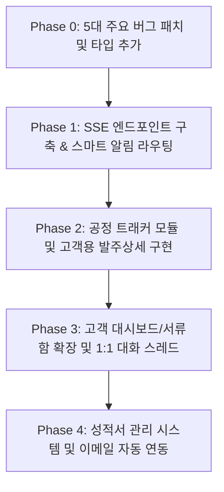

# ALTF B2B 원툴 협업 포털 구현 계획서 (Implementation Plan)

본 설계서는 알트에프(ALTF) 플랫폼의 고객(구매사)과 내부 담당자 간의 견적·발주·미결·서류 관리 프로세스를 단일 웹 포털로 통합하고, 발주 상태를 실시간 비주얼 애니메이션으로 트래킹하기 위한 전체 구현 상세 계획서입니다.

---

## 1. 개요 및 설계 방향

*   **목표:** B2B 거래 편의성을 극대화하여 기존 카카오톡/전화 소통을 최소화하고 플랫폼 안착률을 높임.
*   **핵심 가치:** 고객용 실시간 발주 공정 단계 모니터링(스텝퍼 애니메이션) 제공 및 저비용(이메일, 텔레그램, SSE 기반) 알림 인프라 구축.
*   **보안 원칙:** 고객사 응답 시 매입가/마진 정보(원가 필드)가 브라우저에 절대 다운로드되지 않도록 API 응답 수준에서 필터링 적용.

---

## 2. Phase 0: 버그 수정 계획 (필수 선행 과제)

구현 시작 전 기존 코드 및 데이터의 안정성 확보를 위해 아래 5가지 버그를 먼저 수정합니다.

### BUG-1. 발주 상태값 대소문자 일치화
*   **현상:** DB에 `submitted` (소문자), `PROCESSING` (대문자) 등 상태값이 비표준으로 혼재함.
*   **수정안:**
    1.  `data/db.json` 내의 모든 `order.status` 값을 대문자로 치환하는 1회성 마이그레이션 로직 작성 및 실행.
    2.  `local-api-server.js`에서 신규 발주 저장 시 대문자 `'SUBMITTED'`로 강제 지정.
    3.  발주 수정(`PATCH /api/my/orders/:id`) 시 입력받는 `status` 값에 `.toUpperCase()` 정규화 적용.

### BUG-2. 발주 생성 시 `po_items` 누락 수정
*   **현상:** `POST /api/my/orders` 시 `po_items`가 생성되지 않아 어드민 미결(Pending) 목록에 발주가 조회되지 않는 오류.
*   **수정안:** 발주 요청을 받아 객체를 빌드할 때 `items` 목록을 복사하여 `po_items` 필드를 명시적으로 채워줌.

### BUG-3. 고객 API 응답에서 원가 정보 보안 제거
*   **현상:** 고객용 발주 목록/상세 API 응답 시 원가 관련 민감 필드가 고객 브라우저로 직접 노출됨.
*   **수정안:** 고객 권한으로 조회하는 모든 발주 응답에 필터링 함수(`sanitizeOrderForCustomer`)를 거치도록 수정:
    ```typescript
    function sanitizeOrderForCustomer(order) {
        return {
            ...order,
            po_items: (order.po_items || []).map(item => {
                const { base_price, supplierRate, discountRate, supplierPriceOverride, ...safeItem } = item;
                return safeItem;
            })
        };
    }
    ```

### BUG-4. 발주 데이터 내 담당자 정보(`managerIds`) 누락 해결
*   **현상:** 발주 정보에 담당 매니저 ID 목록이 연결되지 않아 담당자 매핑 및 알림이 불가함.
*   **수정안:** 발주 생성 API 흐름에서 요청을 보낸 고객(`userId`)의 데이터로부터 `managerIds`를 찾아서 발주 레코드에 함께 저장.

### BUG-5. 견적 저장 시 `customerInfo` 스냅샷 누락 보완
*   **현상:** 견적에 전화번호나 이메일이 유실되어 알림 발송 에러 유발 가능.
*   **수정안:** 견적 생성 API 트랜잭션 도중 로그인한 사용자의 정보를 조회하여 `customerInfo` 필드에 상호명, 담당자명, 이메일, 전화번호를 스냅샷 형태로 강제 저장.

---

## 3. 제안 변경 사항 (Proposed Changes)

### [NEW] [processTracker.ts](file:///Volumes/Extreme%20SSD/altf-kr-web-skeleton/src/lib/processTracker.ts)
*   **역할:** 품목별 태그(재고품, 사급 등) 및 발주 상태값을 기반으로 가시적인 공정 트래커 단계(`ProcessStepId`)를 도출해내는 로직 라이브러리 추가.
*   공정 상태 리스트: `RECEIVED` (접수완료) ➔ `STOCK_CHECK` (재고확인) ➔ `MATERIAL_IN` (소재확보) ➔ `IN_PRODUCTION` (제작중) ➔ `READY_TO_SHIP` (출고대기) ➔ `SHIPPING` (배송중) ➔ `DELIVERED` (완료).

### [NEW] [OrderProcessTracker.tsx](file:///Volumes/Extreme%20SSD/altf-kr-web-skeleton/src/components/ui/OrderProcessTracker.tsx)
*   **역할:** 쿠팡/배달의민족 스타일의 공정 단계 표시기.
*   **기능:**
    *   전체 주문 공정 흐름 가로 표시.
    *   품목 단위별 개별 공정 흐름 세로 카드 리스트로 세분화 표시.
    *   현재 단계는 파란색 아이콘 + `animate-pulse` 효과 적용. 완료 단계는 초록색 체크마크 표출.

### [NEW] [notification-router.workflow.ts](file:///Volumes/Extreme%20SSD/altf-kr-web-skeleton/workflows/notification-router.workflow.ts)
*   **역할:** n8n 워크플로우 명세 정의.
*   **기능:** Webhook 요청을 감지하여 이벤트 타입별로 분기 처리.
    *   **담당자 전송 건:** Telegram Bot API 연동 발송.
    *   **고객사 전송 건:** Resend API 연동 HTML 이메일 발송.
    *   **PWA 구독 건:** Web Push API 호출.

### [MODIFY] [index.ts](file:///Volumes/Extreme%20SSD/altf-kr-web-skeleton/src/types/index.ts) 및 [document.ts](file:///Volumes/Extreme%20SSD/altf-kr-web-skeleton/src/types/document.ts)
*   `Certificate` (성적서), `Notification` (인앱 알림), `ThreadMessage` (문서 채팅 스레드) 인터페이스 명세 추가.
*   `DocumentType`에 `'CERTIFICATE'` 확장.
*   `User` 인터페이스에 `notificationChannels` 필드 추가.
*   `Quotation` 및 `Order`에 `thread` 메신저 메시지 스레드 추가.

### [MODIFY] [local-api-server.js](file:///Volumes/Extreme%20SSD/altf-kr-web-skeleton/local-api-server.js)
*   **실시간 SSE 개설:** `GET /api/sse` 엔드포인트 구현 (연결 클라이언트 `sseClients` 맵에 보관).
*   **스마트 알림 엔진:** `smartNotify(recipientId, event)` 함수를 추가하여 대상 사용자가 웹에 접속 중인 경우 실시간 SSE로 전송하고, 오프라인인 경우 n8n Webhook을 호출하여 이메일/텔레그램 모바일 푸시 전송.
*   **데이터베이스 롤링 수정:** `db.notifications`, `db.certificates` 컬렉션 배열 초기 로드 정의 추가.
*   **신규 API 엔드포인트 통합:**
    *   `GET /api/notifications` & `PATCH /api/notifications/:id/read`
    *   `GET /api/certificates` & `POST /api/certificates` & `PATCH /api/certificates/:id`
    *   `GET /api/threads/:docType/:docId` & `POST /api/threads/:docType/:docId/messages`

### [MODIFY] [Pending.tsx](file:///Volumes/Extreme%20SSD/altf-kr-web-skeleton/src/pages/admin/Pending.tsx)
*   미결 항목의 담당자 의견/코멘트 등록 폼 내부 구조 수정.
*   **"고객에게 공개"** 체크박스를 추가하여 해당 코멘트가 고객의 발주 세부 트래커 말풍선 내에 동적으로 보이도록 `isVisibleToCustomer` 필드 연동.

### [MODIFY] [Managers.tsx](file:///Volumes/Extreme%20SSD/altf-kr-web-skeleton/src/pages/admin/Managers.tsx)
*   담당자 생성/수정 모달 폼에 `telegramChatId`, `emailNotify` 수신 옵션, 그리고 고객용 1:1 창구가 될 `kakaoOpenChatUrl` 입력 란 추가.

---

## 4. Phase별 구현 우선순위 및 전략



### Phase 0 — 기초 다지기
*   발주 상태값 대소문자 일괄 대문자 마이그레이션 스크립트 실행.
*   `src/types/index.ts` 타입 정의 추가 및 컴파일 에러 예방을 위한 기본 모듈 껍데기(Stub) 구성.
*   고객 발주 응답 API에서 원가 관련 민감 정보 완전 마스킹 처리.

### Phase 1 — 실시간 알림 시스템
*   Node.js 내 실시간 단방향 스트리밍 통신 SSE 기능 개설.
*   오프라인인 경우 자동으로 카카오 알림톡/이메일/텔레그램 봇으로 이관 처리해 주는 스마트 알림 엔진 구현.
*   어드민 화면에 실시간 알림 Toast + Sound 재생 컴포넌트 추가.

### Phase 2 — 공정 트래커 (주요 시각화)
*   태그와 발주 상태를 분석하여 공정 상태로 전환해주는 유틸리티 설계.
*   쿠팡형 시각적 컴포넌트(`OrderProcessTracker`) 코딩.
*   미결 코멘트 영역에 `isVisibleToCustomer` 체크 연동.

### Phase 3 — 고객 포털 및 채널 연동
*   고객 맞춤 홈 화면 대시보드 개설.
*   서류함 및 알림 센터 페이지 구축.
*   주문 상세/견적 상세 내부에 1:1 고객-담당자 메신저 스레드 기능 연동.

### Phase 4 — 성적서 및 거래명세서 관리
*   품목 성적서 업로드 화면 및 발주 품목 매핑 기능.
*   거래명세표 및 성적서 발행 시 백엔드 단에서 자동으로 메일(PDF 링크)을 발송하는 일괄 흐름 완성.

---

## 5. 검증 계획 (Verification Plan)

### 자동화 테스트 및 정적 분석
*   정적 컴파일 검증: `npx tsc --noEmit` 실행하여 타입 안정성 확인.
*   린트 에러 검증: `npx eslint .` 실행하여 린트 위반 여부 확인.

### 수동 검증 및 동작 시나리오
1.  **SSE 전송 테스트:** 두 브라우저에 각각 '고객' 계정과 '어드민' 계정으로 로그인한 상태에서 견적서를 제출하면 어드민 화면 우측 하단에 알림 토스트가 소리와 함께 정상 노출되는지 확인.
2.  **공정 트래커 시연:** 어드민 미결 페이지에서 품목의 상태를 바꾸거나 태그를 변경할 때, 고객의 발주 트래커가 리로드 없이 애니메이션을 그리며 실시간 전환(Pulse 효과 포함)되는지 테스트.
3.  **보안 검증:** F12 개발자 도구의 Network 탭을 켜고, 고객의 발주 조회 API(`/api/my/orders`) 데이터 응답값에 `base_price`나 `supplierRate` 등의 원가 관련 필드가 전무함을 최종 확인.
